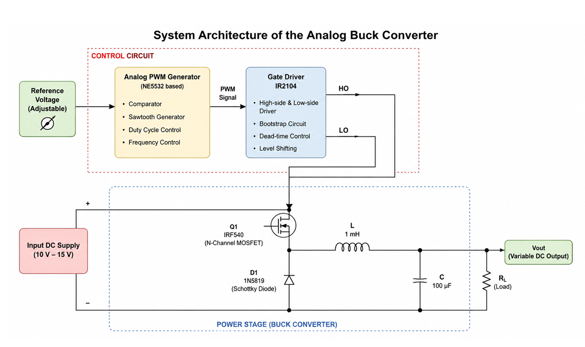
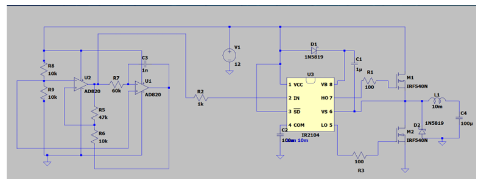
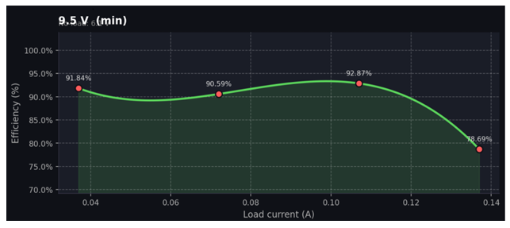
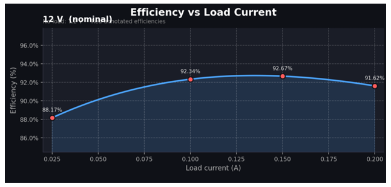
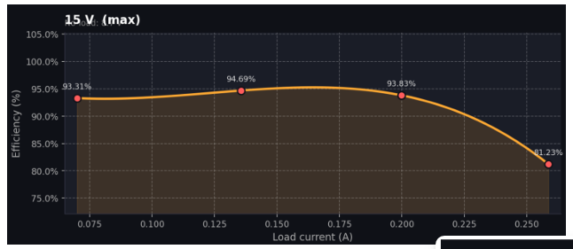
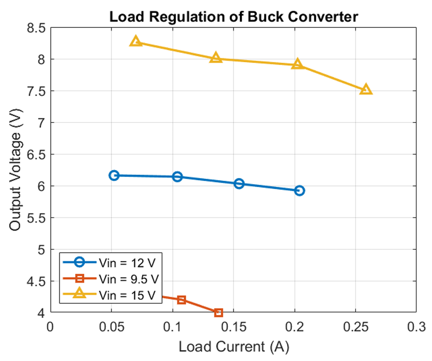

# Analog All-Class Buck Converter

An analog DC-DC Buck Converter designed and implemented for **EN2111: Electronic Circuit Design** at the **Department of Electronic and Telecommunication Engineering, University of Moratuwa**.
The system generates a regulated, variable DC output voltage using a custom op-amp-based PWM generator, an IR2104 high-side gate driver, and an IRF540 N-channel MOSFET switching stage.

---

## Technical Specifications

| Parameter | Value |
| :--- | :--- |
| **Input Voltage Range ($V_{in}$)** | 10 V – 15 V DC |
| **Nominal Input Voltage** | 12 V DC |
| **Output Voltage Range ($V_{out}$)** | 3.0 V – 8.4 V DC (at 12 V input) |
| **Duty Cycle Adjustment Range ($D$)** | 25% – 70% |
| **Switching Frequency ($f_s$)** | ~20 kHz (NE5532 Op-Amp controlled) |
| **Peak Efficiency** | 94.8% (at $V_{in} = 15\text{ V}$) |
| **Output Filter** | 1 mH Radial Inductor + 100 µF Capacitor |

---

## System Architecture

The converter consists of two key stages:
1. **Control Circuit**: Built using an NE5532 op-amp configured as an integrator/comparator oscillator to generate a variable PWM signal, fed into an IR2104 high-side driver with bootstrap circuitry.
2. **Power Stage**: An IRF540 N-channel MOSFET, 1N5819 freewheeling Schottky diode, and LC filter.

  
   
  <em>Figure 1: Functional Block Diagram of the Analog Buck Converter</em>

  
   
  <em>Figure 2: LTspice Circuit Schematic</em>

---

## Hardware Implementation

Hardware prototype assembled on breadboard, featuring discrete logic-level gate driving and bootstrap high-side control.

  
   
  <em>Figure 3: Hardware Implementation & Bench Testing Setup</em>

---

## Performance & Efficiency Curves

Efficiency was evaluated across three distinct input voltages (9.5 V, 12 V, and 15 V) under variable load conditions.

  
  
  
   
  <em>Figure 4: Efficiency vs. Load Current Curves for 9.5V, 12V, and 15V Inputs</em>

  
   
  <em>Figure 5: Output Voltage vs. Load Current (Load Regulation)</em>

---

## Key Hardware Components

* **MOSFET**: IRF540 N-Channel Power MOSFET
* **Gate Driver**: IR2104 High/Low Side Driver
* **PWM Op-Amp**: NE5532 Dual Low-Noise Op-Amp
* **Freewheel Diode**: 1N5819 Schottky Diode
* **Filter Components**: 1 mH Radial Inductor, 100 µF Output Electrolytic Capacitor

---

## Team Contributions

| Student | Registration No. | Key Responsibilities |
| :--- | :--- | :--- |
| **Dilhan W.A** | 230145E | PWM Circuit Design, Component Selection, Testing, Documentation |
| **Karunarathna G.K.T W.A** | 230322U | Buck Converter & Switching Circuit Design, Component Selection, Testing, Documentation |
| **Meedeniya M.M.H** | 230407K | Buck Converter & Switching Circuit Design, Component Selection, Testing, Documentation |
| **Peramunage D.S** | 230473G | PWM Circuit Design, Component Selection, Testing, Documentation |
